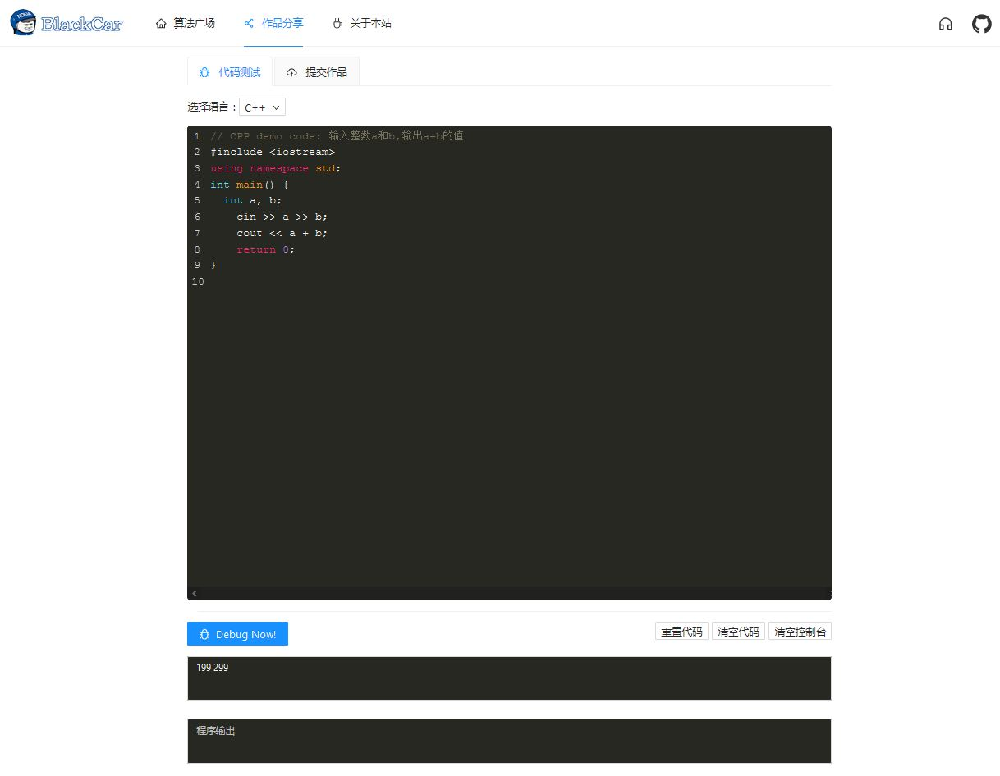
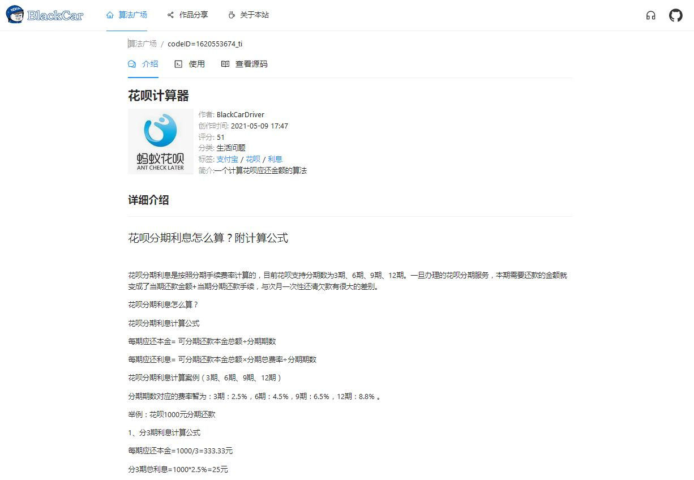
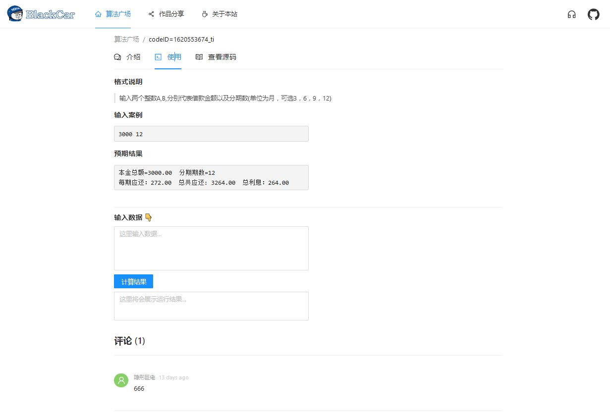
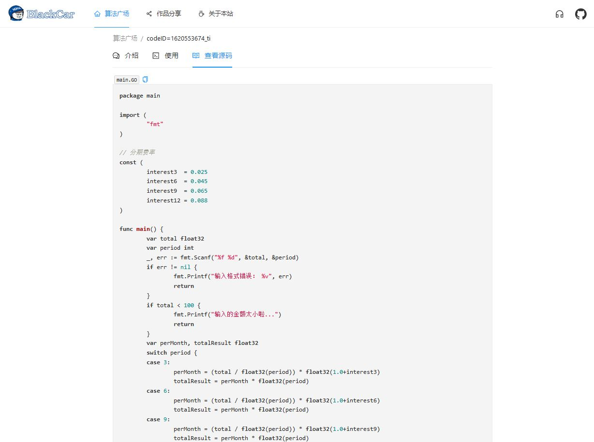

# CodeMaster-FontEnd

个人毕业设计作品：“代码高手” 客户端部分，使用Dva+React+AntDesign 进行开发；

## 使用

- 安装依赖： npm install
- 启动项目：npm start
- 项目构建：npm run-script build

## 效果展示

- 首页

  

- 提交作品

  

- 查看作品信息

  

- 使用作品

  

- 查看源码

  

## 相关链接    

- 后端源码地址：https://github.com/BlackCarDriver/simpleServer
- 编译运行服务：https://github.com/BlackCarDriver/CompilerWorker

